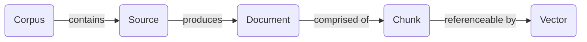

The Ultravox corpus service is the easiest way to add [RAG](https://en.wikipedia.org/wiki/Retrieval-augmented_generation) to your agents. All of the relevant APIs appear under `/api/corpora` (note: 'corpora' is the plural of 'corpus').

## Corpus Overview


Each `Corpus` can contain one or more sources. Each `Source` contributes one or more documents, which are single files (HTML page, PDF, DOC, etc.). Each `Document` is broken up into one or more chunks, which are the units that may be returned for a query. For each `Chunk` several vectors are produced for similarity search.

The API exposes metadata about documents as well as the number of chunks and vectors in a corpus. However, there are no APIs provided to directly manipulate or edit documents, chunks, or vectors. If you need to update or delete documents, you must update or delete the source.

## Providing Corpus Access to Agents
<Warning>
  <b>Keep API Keys Safe</b>
  <br />
  Using the [Query Corpus](/api-reference/corpora/corpus-query) endpoint directly from your agents could expose your Ultravox API key. Use the `queryCorpus` tool instead.
</Warning>
We provide the built-in [queryCorpus](/tools/built-in-tools) tool that should be used by your agents. For example, if we wanted to create a voice agent to answer questions about Seattle, we could provide the tool like this:
    ```json
    {
      "systemPrompt": "Use the queryCorpus tool to answer questions about Seattle.",
      "selectedTools": [
        {
          "toolName": "queryCorpus", 
          "parameterOverrides": {
            "corpus_id": "<your_corpus_id_here>",
            "max_results": 5
          }
        }
      ]
    }
    ```

### queryCorpus Tool Performance
- Maximum of 20 chunks per query
  - By default, the model may dynamically choose a value between 1-20, defaulting to 5. A static value may be provided via override.
  - Query response latency is not significantly impacted by the number of chunks returned.
  - More chunks returned will grow the overall agent context, which will mean slower subsequent generations.
  - More chunks may also confuse the agent if most chunks are irrelevant.

## Limits and Configuration

### Overall Limits
The system has the following limits:
- 20 sources (max) per corpus
- 200 documents (max) per source
- 10MB (max) document size for file uploads

### Account Limits
- Default limit is 2 corpora per account
- [Paid plans](https://ultravox.ai/pricing) have higher limits on corpora

### Document Management
- Documents can be viewed but not edited directly
- To update documents, create a new source
- Supported document types:
  - Text files (including Markdown)
  - PDFs
  - Word documents
  - EPUB files
  - PowerPoint presentations

  Note: If there are additional content types you need, please [let us know](https://discord.com/channels/1240071833798184990/1323352273165881426).

### Source Management
- PATCH requests on a source triggers a refresh/recrawl while maintaining the ID and created timestamp
- The corpus is still queryable during a recrawl but might return inconsistent (i.e. outdated) resources until the recrawl is finished
- Provided urls via `startUrls` will trigger crawling on anything in the same domain (subdomains must be specified separately)

### Deletion Behavior
- Deleting a corpus cascades to remove all associated:
  - Sources
  - Documents
  - Chunks
  - Vectors
- Deleted corpora cannot be queried
- Deleting a source cascades to remove all associated documents, chunks, and vectors