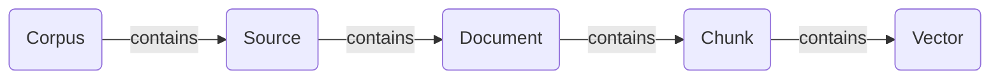

The Ultravox corpus service provides powers RAG for your agents. All of the relevant APIs appear under `/api/corpora` (note: 'corpora' is the plural of 'corpus').

## Corpus Overview


Each `Corpus` can contain one or more sources. Each `Source` can contain one or more documents. Each `Document` is broken up into one or more chunks. Each `Chunk` is then stored as one or more vectors.

The API exposes metadata about documents as well as the number of chunks and vectors in a corpus. However, there are no APIs provided to directly manipulate or edit documents, chunks, or vectors. If you need to update or delete documents, you must update or delete the source.

## Providing Corpus Access to Agents
<Warning>
  <b>Keep API Keys Safe</b>
  <br />
  Using the [Query Corpus](/api-reference/corpora/corpus-query) endpoint directly from your agents could expose your Ultravox API key. Use the `queryCorpus` tool instead.
</Warning>
We provide the built-in [queryCorpus](/essentials/tools#built-in-tools) tool that should be used by your agents. For example, if we wanted to create a voice agent to answer questions about Seattle, we could provide the tool like this:
    ```json
    {
      "systemPrompt": "Use the queryCorpus tool to answer questions about Seattle.",
      "selectedTools": [
        {
          "toolName": "queryCorpus", 
          "parameterOverrides": {
            "corpus_id": "<your_corpus_id_here>",
            "max_results": 5
          }
        }
      ]
    }
    ```

### queryCorpus Tool Performance
- Maximum of 20 chunks per query
  - Model dynamically chooses value between 1-20
  - Query response latency is not impacted by the number of chunks returned
  - More chunks returned will grow the overall agent context and will mean slower subsequent generations

## Limits and Configuration

### Account Limits
- Default limit is 2 corpora per account
- No limit on the number of sources within a corpus

### Document Management
- Documents can be viewed but not edited directly
- To update documents, create a new source
- Supported document types:
  - Text files (including Markdown)
  - PDFs
  - Word documents
  - EPUB files
  - PowerPoint presentations

### Source Management
- PUT request on a source triggers a refresh while maintaining the ID and created timestamp
- Provided urls via `startUrls` will trigger crawling on anything in the same domain (subdomains must be specified separately)

### Deletion Behavior
- Deleting a corpus cascades to remove all associated:
  - Sources
  - Documents
  - Chunks
  - Vectors
- Deleted corpora cannot be queried
- Deleting a source cascades to remove all associated documents, chunks, and vectors