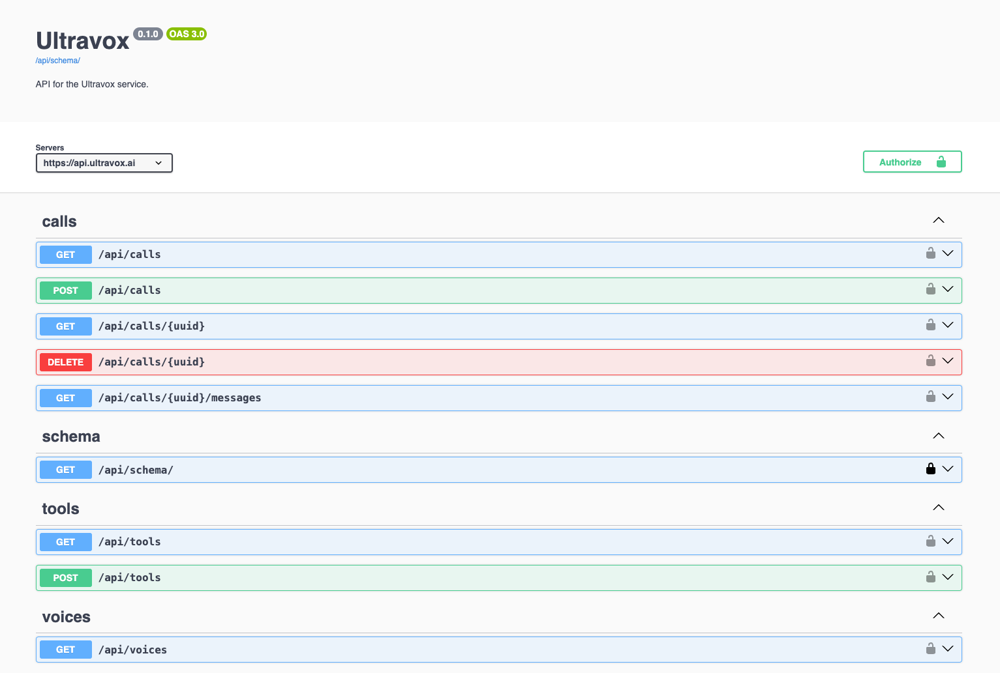

## API Playground
There is a hosted, interactive API playground available at https://api.ultravox.ai/api/schema/swagger-ui. This enables you to visually explore the Ultravox API and to make calls to the API directly in your browser.

## OpenAPI Specification
We have an OpenAPI spec (OAS) file available for [download](https://api.ultravox.ai/api/schema/).
