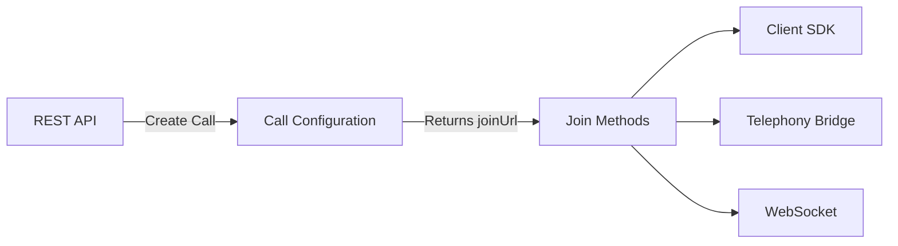

import CTAFirstAgent from '/snippets/firstAgent.mdx'

<Note>
Ultravox powers millions of voice interactions monthly for companies ranging from YC startups to Fortune 500s.
</Note>

## Introduction

Ultravox Realtime enables you to build voice AI agents that work with your choice of telephony provider, with web or native apps, or in custom ways by using websockets and our native protocol. Built on our best-in-class open-weight model, Ultravox understands speech directly without relying on traditional ASR pipelines.

## What Makes Ultravox Different

<CardGroup cols={2}>
  <Card title="No ASR = Real Understanding" icon="brain">
    Direct speech processing = faster responses + better context awareness.
  </Card>
  <Card title="Unlimited Scale" icon="infinity">
    No concurrency caps on paid plans.
  </Card>
  <Card title="BYOT" icon="plug">
    Bring Your Own Telephony. Total flexibility.
  </Card>
  <Card title="$0.05/min Enterprise Performance" icon="dollar-sign">
    Production-ready voice AI at an unbeatable price.
  </Card>
</CardGroup>

## Getting Started: Console vs API

### Ultravox Console (No-Code)
The [Ultravox Console](https://app.ultravox.ai) lets you quickly build and test agents without writing any code.

Perfect for:
- Experimenting with prompts and voices
- Testing agent behavior
- Rapid prototyping
- Getting familiar with Ultravox capabilities

[Explore Console →](https://app.ultravox.ai)

### API-First Platform
While the console is great for getting started, Ultravox is fundamentally an **API-first platform**. You should expect to write code to integrate voice agents into your applications.

Our REST API and SDKs give you complete control over:
- Dynamic agent configuration
- Custom tool integration
- Advanced call flows
- Production deployments
- Integrating voice AI into phone calls, web apps, and native apps

[Learn More →](/apps/overview)

## Core Architecture

<Note>
**No ASR Pipeline**: Unlike traditional, component model voice AI systems, Ultravox understands speech directly. There's no automatic speech recognition (ASR) stage, making conversations faster and more context-aware. Context matters. We want Ultravox to hear the world as we hear it. This makes Ultravox faster and better at understanding than other systems that rely on ASR and speech to text.
</Note>

### Creating & Joining Calls

Every Ultravox interaction follows a simple pattern:

1. **Call Creation** → Configure and create calls via REST API
2. **Join Call** → Connect users through SDKs, telephony, or WebSockets

## Bring Your Own Telephony

Ultravox is designed as a **bring-your-own-telephony platform**, giving you complete flexibility in how you connect voice AI to your users (inbound or outbound). Whether you're using SIP trunking, Twilio, or any other telephony provider, Ultravox seamlessly integrates with your existing infrastructure.

[Learn More →](/telephony/overview)

## Key Principles

### 1. It's All About Prompting
Everything your agents do is based on the prompt instructions you give them. While it's tempting to write verbose prompts, focused instructions yield better results.

Remember:
- Tool names and descriptions are visible to the model
- Complex interactions may need multiple call stages
- Less is often more when it comes to instruction clarity

[Explore Prompting Guide →](/gettingstarted/prompting) 

[Guiding Agents →](/agents/guiding-agents)

### 2. Tools Are Just Functions
Ultravox includes built-in tools and you can create custom tools. Tools (AKA function calling) give your agents superpowers—from accessing databases to making API calls. They're versatile, powerful, and straightforward to implement. Whether you're building customer support bots or sales agents, tools connect your AI to the real world.

At their core, tools are functions that agents can invoke to perform actions or retrieve information. Any functionality you can encapsulate in a function can be exposed to your agents as a tool. Addtionally, Ultravox automatically calls the underlying function so you don't have to sweat gluing things together.

[Learn More →](/tools/overview)

### 3. Speed and Affordability
Voice AI only works when conversations feel natural and fluid. No awkward pause.  No lag. Just smooth back-and-forth dialogue that feels human. Ultravox Realtime doesn't just meet this standard—it sets it.

#### Speed That Speaks for Itself
Don't take our word for it. [See the numbers](https://www.ultravox.ai/blog/ultravox-v0-5-taking-the-lead-in-speech-understanding) yourself for comparisons between Ultravox Realtime and other leading platforms. Our benchmarks tell a clear story: when it comes to real-time voice AI, speed matters, and we deliver.

#### Enterprise Performance. Consumer Prices.
At just $0.05 per minute, Ultravox Realtime delivers enterprise-grade performance at consumer prices. Why? Because we believe groundbreaking technology should come with groundbreaking pricing. You can pay-as-you-go if you have commitment issues. We also have [paid plans](https://www.ultravox.ai/pricing) that remove all call concurrency caps so you can scale.

No hidden fees. Just straightforward rates that make premium voice AI accessible to everyone.

<CTAFirstAgent />

## Need Help?
<Info>
**Still have questions?** Our engineering team hangs out in Discord and typically responds within minutes. See [Getting Help](/gettingstarted/getting-help).
</Info>