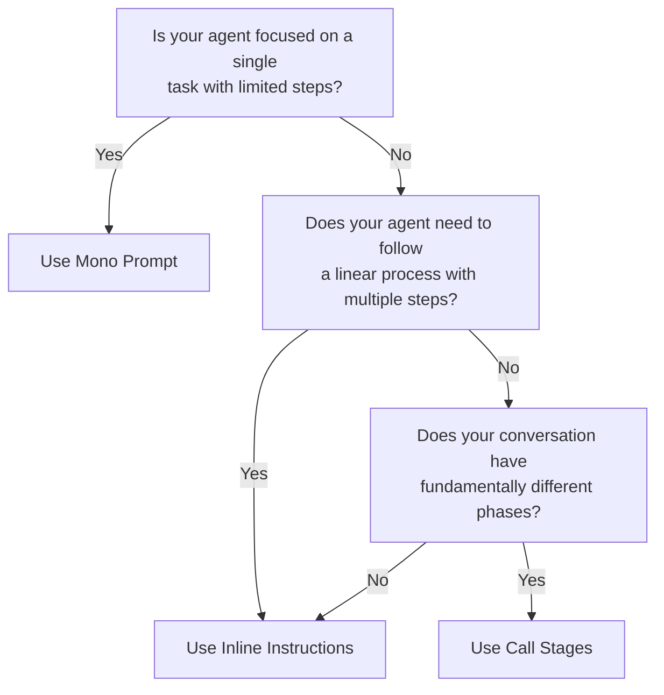

## Introduction

When building voice AI applications, one of the most significant challenges is ensuring your agent stays "on rails" - following a predictable, deterministic conversational path while still feeling natural and responsive. This is particularly important for task-oriented agents like those handling appointments, customer support cases, or multi-step processes.

The challenge lies in an inherent tension: language models are designed to be flexible and generative, but many business applications require reliability and predictability. The more rigidly you try to control an LLM's behavior, the more likely you are to get unnatural, stilted responses. Conversely, giving the model too much freedom can lead to conversations that wander off-topic or agents that miss critical steps in a process.

This guide explores three primary approaches to managing this tension, along with their pros, cons, and ideal use cases. You'll also learn about the API primitives that power these approaches and how to implement them effectively.

<Warning>
  Disclaimer: We are still dealing with LLMs. There is no silver bullet. YMMV. See [The First Rule of Ultravox](/gettingstarted/rule1).
</Warning>

## The Challenge of LLM Determinism

Language models are inherently stochastic systems. Their power comes from their flexibility - the ability to handle a wide range of inputs and generate contextually appropriate, creative responses. However, this same flexibility makes them challenging to control in scenarios where you need predictable, repeatable behavior.

Consider a customer support scenario where your agent needs to:
1. Identify the customer's issue
2. Collect specific information
3. Check if the issue matches known solutions
4. Either provide a solution or escalate to a human

Without proper guidance, an LLM might:
- Skip important data collection steps
- Jump ahead to solutions without full information
- Get sidetracked by tangential conversation
- Forget to check databases before answering
- Miss escalation criteria

The paradox is that the more constraints you add to control these behaviors, the more unnatural and robotic the interaction can become. The key is finding the right balance of guidance and flexibility.

## Three Approaches to Agent Control

There are three primary methods for keeping your agent on track, each with its own strengths and ideal use cases:

<CardGroup cols={3}>
  <Card title="Mono Prompt" icon="scroll" href="#approach-1-mono-prompt">
    Embedding all instructions in one comprehensive system prompt.
  </Card>
  <Card title="Inline Instructions" icon="comment-exclamation" href="#approach-2-inline-instructions">
    Dynamically guiding the agent through tools and deferred messages.
  </Card>
  <Card title="Call Stages" icon="arrow-progress" href="#approach-3-call-stages">
    Breaking the conversation into distinct phases with different parameters.
  </Card>
</CardGroup>

Let's explore each approach in detail.

### <Icon icon="scroll" size={24} /> Approach 1: Mono Prompt

The simplest approach is to put all instructions, constraints, and guidance directly in your system prompt. This works by frontloading all the agent's "rules of engagement" before the conversation begins.

#### How It Works + Example

Your system prompt becomes a comprehensive instruction set that includes:
- The agent's role and personality
- Specific steps to follow for different scenarios
- Error handling procedures
- When to use specific tools
- Conversation boundaries

```text Example: Mono Prompt
You are Maya, a dental appointment scheduling assistant. Your job is to:
1. Greet the caller and ask how you can help
2. If they want to schedule an appointment:
   a. Ask for their name and phone number
   b. Check available slots using the checkAvailability tool
   c. Confirm their selection
   d. Use the scheduleAppointment tool to book it
   e. Provide a confirmation summary
3. If they ask about services:
   a. Use the getDentalServices tool to retrieve information
   b. Answer questions about procedures, costs, and insurance
4. For any other inquiries, politely explain you can only help with appointments and services
5. Keep responses brief and conversational, suitable for voice
6. Never make up information - only use data from tools
```

#### Pros
- **Simplicity**: Easy to implement - just one prompt to manage
- **Low latency**: No additional API calls or state transitions during the conversation
- **Transparency**: All agent instructions are visible in one place
- **Consistency**: The agent has all guidelines from the start

#### Cons
- **Limited complexity**: As your flowchart grows, the system prompt becomes unwieldy
- **Static instructions**: Cannot easily adapt to changing conversation context
- **Divided attention**: The agent must juggle all possible paths simultaneously. As the conversation history grows, the model may forget or confuse instructions.

#### Ideal Use Cases
- **Simple agents**: Chatbots with a single clear purpose and limited conversation paths
- **Informational agents**: Assistants that primarily retrieve and present information
- **Conversational agents**: When natural conversation and/or personality consistency is more important than strict process adherence

### <Icon icon="comment-exclamation" size={24} /> Approach 2: Inline Instructions

This approach uses tool responses and deferred messages to guide the agent at each step of the conversation. Rather than trying to frontload all instructions, you continuously remind the agent of what to do next.

This approach leverages three key building blocks:
- **Deferred Messages**: Inject user messages without triggering an immediate response from the model
- **Tool State**: Pass additional context via tools to maintain state
- **Tool Response Messages**: Instruct the agent what to do next via tool call responses

#### How It Works + Example

1. Start with a simpler system prompt focused on the agent's general role and behavior
2. Use tools to provide step-specific instructions to the agent
3. The tool responses include guidance on what the agent should do next
4. Tool state maintains context between turns
5. Deferred messages allow inserting information without derailing the conversation flow

**Example: Insurance Claims Processing**

An insurance claims agent that guides customers through the claims submission process. The agent uses a central claims tool that maintains state about which documents have been collected, what information is still missing, and what step comes next. At each step of the conversation, the tool response includes clear instructions on what to ask the customer next, helping the agent stay focused on the current step of the process rather than trying to hold the entire claims procedure in context.

#### Building Blocks

##### Deferred Messages
Deferred messages allow you to inject a user message without causing the agent to generate a response immediately. The message gets appended to the conversation history but doesn't trigger an LLM generation.

TODO link to api docs on defer_message

https://docs.ultravox.ai/datamessages#inputtextmessage


TODO code snippet/example

##### Tool State
Tool state allows you to maintain state between tool calls, passing context from one call to the next. This is particularly useful for guiding the agent through a multi-step process.

TODO link to api docs/places where this is set/retrieved
https://docs.ultravox.ai/api-reference/calls/calls-post#body-initial-state

TODO code snippet/example

The agent will not see the tool state directly. It allows you to pass information between tool calls and then use that information inside tools and to impact the responses from tool calls.

##### Tool Response Messages
Instead of having a tool call result send a 200 with "Successfully entered customer information", you can provide an instruction of what the agent should do next (e.g. "Successfully recorded customer name. Next ask for their email").

TODO code snippet/example

#### Real-World Example

**Appointment Scheduling Flow**

Here's an example of how you might implement an appointment scheduling flow using Inline Instructions:

1. **System Prompt**

```text Example: Simplified Prompt for Inline Instructions
You are Maya, a friendly dental appointment scheduling assistant. Speak 
conversationally and follow instructions carefully. Always use the appropriate 
tools to retrieve or submit information. Never make up facts not provided by tools.
```

2. **Tool Definition** 

TODO code snippet showing the tool and how to do CTS
```js
const schedulingTool = {
  name: "schedulingAssistant",
  description: "Helps manage the appointment scheduling process",
  parameters: {
    type: "object",
    properties: {
      action: {
        type: "string",
        enum: ["start", "collectInfo", "checkAvailability", "confirm", "schedule"],
        description: "The current action in the scheduling flow"
      },
      customerName: {
        type: "string",
        description: "Customer's full name"
      },
      phoneNumber: {
        type: "string",
        description: "Customer's contact number"
      },
      appointmentType: {
        type: "string",
        description: "Type of dental appointment"
      },
      preferredDate: {
        type: "string",
        description: "Customer's preferred date (YYYY-MM-DD)"
      }
    },
    required: ["action"],
    // Automatically include the current tool state
    additionalProperties: {
      currentState: "$callToolState"
    }
  }
}
```

3. **Tool Implementation** with state management:

TODO

```js
// Implementing the scheduling tool with state transitions
async function handleSchedulingTool(params, callToolState) {
  // Parse the current state or initialize
  const state = callToolState ? JSON.parse(callToolState) : { step: 'initial' };
  
  let result = '';
  let newState = { ...state };
  
  switch (params.action) {
    case 'start':
      result = "I can help schedule a dental appointment. " +
               "NEXT: Ask for the customer's full name and phone number.";
      newState.step = 'collecting_info';
      break;
      
    case 'collectInfo':
      // Store customer information
      newState.customerName = params.customerName || state.customerName;
      newState.phoneNumber = params.phoneNumber || state.phoneNumber;
      
      if (newState.customerName && newState.phoneNumber) {
        result = `Customer information collected: ${newState.customerName}, ${newState.phoneNumber}. ` +
                 "NEXT: Ask what type of appointment they need (cleaning, filling, etc.) " +
                 "and their preferred date.";
        newState.step = 'collect_appointment_details';
      } else {
        result = "Information incomplete. " +
                 "NEXT: Continue asking for name and phone number.";
      }
      break;
    
    case 'checkAvailability':
      // Here you would check actual availability in your backend
      newState.appointmentType = params.appointmentType || state.appointmentType;
      newState.preferredDate = params.preferredDate || state.preferredDate;
      
      // Simulated available slots
      const availableSlots = ["10:00 AM", "2:30 PM", "4:15 PM"];
      
      result = `Available slots for ${newState.appointmentType} on ${newState.preferredDate}: ` +
               `${availableSlots.join(', ')}. ` +
               "NEXT: Ask the customer to select one of these time slots.";
      newState.availableSlots = availableSlots;
      newState.step = 'confirm_selection';
      break;
    
    // Additional cases for confirm and schedule...
  }
  
  // Return result with new state
  return {
    result: result,
    toolState: newState
  };
}
```

4. **Using Deferred Messages** to inject context:

TODO:  Do we want to show this given the limitation with telephony?


#### Pros
- **Focused guidance**: Instructions are context-specific and timely
- **Dynamic adaptation**: Can respond to changing conversation flow
- **Reduced cognitive load**: The agent only needs to understand the current step
- **Maintainable complexity**: Can handle complex workflows without overwhelming the system prompt
- **No latency spikes**: Avoids the performance hit of call stage transitions

#### Cons
- **Implementation complexity**: Requires more backend code to manage state

#### Ideal Use Cases
- **Multi-step processes**: Tasks with clear sequential steps like form filling or data collection
- **Transaction flows**: E-commerce, booking systems, or other task-completion scenarios
- **Customer support triage**: Guiding agents through problem diagnosis trees
- **Interactive tutorials**: Step-by-step guidance through a learning process

### <Icon icon="arrow-progress" size={24} /> Approach 3: Call Stages

Call Stages provide the most comprehensive control by segmenting conversations into distinct phases, each with its own system prompt, tools, and parameters. This approach is covered in detail in our [Call Stages](/guides/callstages) documentation, so we'll focus on positioning when to use it relative to the other approaches.

#### Quick Overview
- Each stage can have a completely different system prompt
- Stages can use different tools, voices, and conversation histories
- Transitions between stages are explicit and controlled

#### Pros
- **Complete flexibility**: Change anything about the agent at stage boundaries
- **Clean separation**: Each stage can be developed and tested independently
- **Simplified prompts**: Each stage's prompt can be focused on a specific task

#### Cons
- **Latency impact**: Stage transitions effectively restart the call (while maintaining connection)
- **Complexity**: Requires careful planning of stage transitions

#### Ideal Use Cases
- **Character switching**: Transitioning between different agent personalities
- **Escalation scenarios**: Moving from automated support to "supervisor" level
- **Distinct conversation phases**: When different parts of a conversation have fundamentally different needs

#### Real-World Example
**Advanced Customer Support**

A support system that begins with a general-purpose triage agent, then transitions to specialized agents based on the issue category. For example, a customer calling about a billing dispute might start with a general support agent, then be transferred to a billing specialist stage with different tools, voice, and approach. This is an ideal case for stages because each specialist domain requires substantially different knowledge, tools, and conversation styles.

## Choosing the Right Approach

Consider these guidelines when deciding which approach to use:

1. **Start simple**: Always begin with the Mono Prompt approach if possible
2. **Scale gradually**: Move to Inline Instructions when your flow becomes too complex for a single prompt
3. **Use Call Stages sparingly**: Reserve for scenarios with truly distinct conversation phases

Here's a decision tree to help choose:



## Advanced State Management Techniques

For complex implementations using the Inline Instructions approach, consider these best practices:

### Structured Tool Response Format

Develop a consistent format for tool responses that separates:
1. **User-facing information**: What the agent should tell the user
2. **Agent instructions**: What the agent should do next (prefixed clearly)
3. **Context preservation**: Key information to remember

Example:
```
AGENT INFO: Customer has verified identity and is eligible for premium service.
USER INFO: Available appointment slots are Monday at 10am, Tuesday at 2pm, and Wednesday at 3pm.
NEXT ACTION: Ask customer to select a preferred time slot from the options.
REMEMBER: Customer mentioned they prefer afternoons if available.
```

## Example: Customer Information Collection

TODO update this

Here's a complete example of implementing a customer information collection system using Inline Instructions:

```javascript
// System Prompt - Notice how simple it is
const systemPrompt = `
You are a friendly customer service agent for Acme Corporation. 
Speak conversationally and follow the guidance provided in tool responses.
Always use tools to record customer information or check records.
`;

// Define the customerInfo tool
const customerInfoTool = {
  name: "customerInfo",
  description: "Manages customer information collection and verification",
  parameters: {
    type: "object",
    properties: {
      action: {
        type: "string",
        enum: ["start", "recordName", "recordEmail", "recordPhone", "verify", "complete"],
        description: "The current action in the information collection flow"
      },
      name: {
        type: "string",
        description: "Customer's full name"
      },
      email: {
        type: "string",
        description: "Customer's email address"
      },
      phone: {
        type: "string",
        description: "Customer's phone number"
      }
    },
    required: ["action"],
    additionalProperties: {
      currentState: "$callToolState"
    }
  }
};

// Implementation logic for the tool
async function handleCustomerInfoTool(params, callToolState) {
  // Parse existing state or initialize new state
  const state = callToolState ? JSON.parse(callToolState) : { 
    step: 'initial',
    collected: {}
  };
  
  let result = '';
  let newState = { ...state };
  
  switch (params.action) {
    case 'start':
      result = "I'll help collect your information. " +
               "AGENT INSTRUCTION: Ask for the customer's full name first.";
      newState.step = 'collecting_name';
      break;
      
    case 'recordName':
      if (params.name) {
        newState.collected.name = params.name;
        result = `Thanks, I've recorded your name as ${params.name}. ` +
                 "AGENT INSTRUCTION: Now ask for their email address.";
        newState.step = 'collecting_email';
      } else {
        result = "I didn't catch the name properly. " +
                 "AGENT INSTRUCTION: Please ask for their full name again.";
      }
      break;
    
    case 'recordEmail':
      if (params.email && params.email.includes('@')) {
        newState.collected.email = params.email;
        result = `Great, I've noted your email as ${params.email}. ` +
                 "AGENT INSTRUCTION: Now ask for their phone number.";
        newState.step = 'collecting_phone';
      } else {
        result = "That doesn't look like a valid email address. " +
                 "AGENT INSTRUCTION: Please ask for a valid email address including an @ symbol.";
      }
      break;
    
    case 'recordPhone':
      // Simple validation - would be more complex in production
      if (params.phone && params.phone.length >= 10) {
        newState.collected.phone = params.phone;
        result = `Perfect, I've saved your phone number as ${params.phone}. ` +
                 "AGENT INSTRUCTION: Now summarize all collected information and ask the customer to verify it's correct.";
        newState.step = 'verifying';
      } else {
        result = "I need a complete phone number with area code. " +
                 "AGENT INSTRUCTION: Please ask for their full phone number again.";
      }
      break;
      
    case 'verify':
      const info = newState.collected;
      result = `I have your information as: Name: ${info.name}, Email: ${info.email}, Phone: ${info.phone}. ` +
               "AGENT INSTRUCTION: If the customer confirms this is correct, mark as complete. " +
               "If they want to change something, ask which field they'd like to update.";
      newState.step = 'awaiting_verification';
      break;
      
    case 'complete':
      result = "Thank you! I've successfully saved all your information. " +
               "AGENT INSTRUCTION: Information collection is complete. You can now proceed with helping the customer with their query.";
      newState.step = 'completed';
      newState.completed = true;
      break;
  }
  
  return {
    result: result,
    toolState: newState
  };
}
```

## Conclusion

Keeping your AI agent "on rails" is a balance between control and natural conversation. The right approach depends on your specific use case:

- **Mono Prompt**: For simple, focused agents with limited conversation paths
- **Inline Instructions**: For complex, multi-step processes requiring dynamic guidance
- **Call Stages**: For conversations with fundamentally different phases requiring complete parameter changes

As you develop your Ultravox application, start with the simplest approach that meets your needs, and gradually increase complexity as required. Remember that the most effective voice experiences feel natural while still accomplishing their goals reliably.

By leveraging building blocks like deferred messages, tool state, and targeted tool response messages, you can create sophisticated conversational flows that guide users through complex processes while maintaining the natural feel of human conversation.