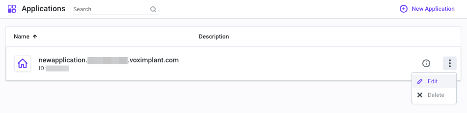
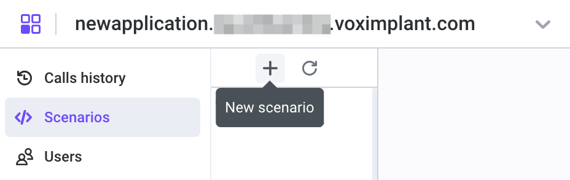

<Note>
Voximplant provides a platform for telephony and has created a native integration with Ultravox to enable SIP calling. This content has been provided courtesy of Voximplant.
</Note>
## Connecting to SIP Trunk with Voximplant

With Voximplant, you can connect Ultravox Realtime to an existing SIP telephony server. This allows you to use Ultravox AI assistants to handle your calls and assist your customers right from your existing infrastructure.

Voximplant acts as a gateway, managing connections with Ultravox via WebSockets and making/receiving calls via SIP.


Follow the steps below to connect Ultravox to your SIP PBX server.

### Step 1: Create a Voximplant Application
To create an application, [log in to your Voximplant account](https://manage.voximplant.com/?utm_source=docs&utm_medium=applications&utm_campaign=gettingstarted) or create a new one. Then, navigate to the [application section](https://manage.voximplant.com/applications?utm_source=docs&utm_medium=applications&utm_campaign=gettingstarted) from the upper left corner of the page. Click **New application** in the upper right corner or **Create** at the bottom of the page.


This opens a new application editor window where you can set it up and save by clicking **Create**. The newly created app appears in the application list. To modify its name, icon, or description, click the three dots menu and select **Edit**.



You can learn more about Voximplant applications and their sections in the [Getting started → Applications](https://voximplant.com/docs/getting-started/basic-concepts/applications) section of their documentation.

### Step 2: Create Scenarios Within the Application
Scenarios in Voximplant are JavaScript documents within a Voximplant application, where you can implement logic processing calls and messages.

To create a scenario, open your existing or newly created [application](https://voximplant.com/docs/getting-started/basic-concepts/applications), select **Scenarios** on the left menu, and click on the plus icon to create a new scenario. Give it a name.



This opens a new tab in the online IDE on the right, where you can write your code. If needed, you can rename the scenario or modify the source code later.

You can learn more about scenarios and their best practice tips in the [Getting started → Scenarios](https://voximplant.com/docs/getting-started/basic-concepts/scenarios) section of the Voximplant documentation.

### Step 3: Utilize Ready-to-use Scenarios
To connect your SIP PBX with Ultravox, Voximplant prepared two ready-to use scenarios for incoming and outgoing calls.

<Info>
**Please note**: We have hidden sensitive information in these scenarios, such as API keys, with placeholders. Please, replace the placeholders with your actual Ultravox credentials.
</Info>

Here is the `incoming` scenario for processing incoming calls forwarded to Voximplant:

```js
require(Modules.Ultravox);

VoxEngine.addEventListener(AppEvents.CallAlerting, async ({ call }) => {
  let webSocketAPIClient = undefined;

  call.answer();
  const callBaseHandler = () => {
    if (webSocketAPIClient) webSocketAPIClient.close();
    VoxEngine.terminate();
  };
  call.addEventListener(CallEvents.Disconnected, callBaseHandler);
  call.addEventListener(CallEvents.Failed, callBaseHandler);

  const onWebSocketClose = (event) => {
    Logger.write('===ON_WEB_SOCKET_CLOSE==');
    Logger.write(JSON.stringify(event));
    VoxEngine.terminate();
  };

  const ULTRAVOX_API_KEY = 'YOUR_ULTRAVOX_API_KEY';
  const AUTHORIZATIONS = {
    'X-API-Key': ULTRAVOX_API_KEY,
  };

  const MODEL = 'fixie-ai/ultravox';
  const VOICE_NAME = 'Mark';
  const PATH_PARAMETERS = {};

  // Use this object when Ultravox.HTTPEndpoint.CREATE_AGENT_CALL
  const PATH_PARAMETERS_AGENT_CALL = {agent_id: "YOUR-AGENT-ID"};

  const QUERY_PARAMETERS = {};
  const BODY_CREATE_CALL = {
    systemPrompt: 'You are a helpful assistant',
    model: MODEL,
    voice: VOICE_NAME,
  };

  // Use this object when Ultravox.HTTPEndpoint.CREATE_AGENT_CALL
  const BODY_CREATE_AGENT_CALL = {
  };

  const webSocketAPIClientParameters = {
    // or Ultravox.HTTPEndpoint.CREATE_AGENT_CALL
    endpoint: Ultravox.HTTPEndpoint.CREATE_CALL, // Change for agent call
    authorizations: AUTHORIZATIONS,
    pathParameters: PATH_PARAMETERS, // Change for agent call
    queryParameters: QUERY_PARAMETERS,
    body: BODY_CREATE_CALL, // Change for agent call
    onWebSocketClose,
  };

  try {
    webSocketAPIClient = await Ultravox.createWebSocketAPIClient(webSocketAPIClientParameters);
    VoxEngine.sendMediaBetween(call, webSocketAPIClient);

    webSocketAPIClient.addEventListener(Ultravox.WebSocketAPIEvents.Unknown, (event) => {
      Logger.write('===Ultravox.WebSocketAPIEvents.Unknown===');
      Logger.write(JSON.stringify(event));
    });

    webSocketAPIClient.addEventListener(Ultravox.WebSocketAPIEvents.HTTPResponse, (event) => {
      Logger.write('===Ultravox.WebSocketAPIEvents.HTTPResponse===');
      Logger.write(JSON.stringify(event));
    });

    webSocketAPIClient.addEventListener(Ultravox.WebSocketAPIEvents.State, (event) => {
      Logger.write('===Ultravox.WebSocketAPIEvents.State===');
      Logger.write(JSON.stringify(event));
    });

    webSocketAPIClient.addEventListener(Ultravox.WebSocketAPIEvents.Transcript, (event) => {
      Logger.write('===Ultravox.WebSocketAPIEvents.Transcript===');
      Logger.write(JSON.stringify(event));
    });

    webSocketAPIClient.addEventListener(Ultravox.WebSocketAPIEvents.ClientToolInvocation, (event) => {
      Logger.write('===Ultravox.WebSocketAPIEvents.ClientToolInvocation===');
      Logger.write(JSON.stringify(event));
    });

    webSocketAPIClient.addEventListener(Ultravox.WebSocketAPIEvents.Debug, (event) => {
      Logger.write('===Ultravox.WebSocketAPIEvents.Debug===');
      Logger.write(JSON.stringify(event));
    });

    webSocketAPIClient.addEventListener(Ultravox.WebSocketAPIEvents.PlaybackClearBuffer, (event) => {
      Logger.write('===Ultravox.WebSocketAPIEvents.PlaybackClearBuffer===');
      Logger.write(JSON.stringify(event));
      if (webSocketAPIClient) webSocketAPIClient.clearMediaBuffer();
    });

    const userTextMessageContent = {
      type: 'user_text_message',
      text: 'HI!',
    };
    webSocketAPIClient.inputTextMessage(userTextMessageContent);
  } catch (error) {
    Logger.write('===SOMETHING_WENT_WRONG===');
    Logger.write(error);
    VoxEngine.terminate();
  }
});
```

Here is the `outgoing` scenario for processing outgoing calls:

```js
require(Modules.Ultravox);

VoxEngine.addEventListener(AppEvents.Started, async () => {
  let webSocketAPIClient = undefined;
  //Obtain parameters passed to call
  const customData = JSON.parse(VoxEngine.customData());

  const call = VoxEngine.callSIP(`sip:${customData["number"]}@sip.example.org`,customData["callerid"]);

  const callBaseHandler = () => {
    if (webSocketAPIClient) webSocketAPIClient.close();
    VoxEngine.terminate();
  };
  call.addEventListener(CallEvents.Disconnected, callBaseHandler);
  call.addEventListener(CallEvents.Failed, callBaseHandler);

  call.addEventListener(CallEvents.Connected, async () => {

    const onWebSocketClose = (event) => {
        Logger.write('===ON_WEB_SOCKET_CLOSE==');
        Logger.write(JSON.stringify(event));
        VoxEngine.terminate();
      };

    const ULTRAVOX_API_KEY = 'YOUR_ULTRAVOX_API_KEY';
      const AUTHORIZATIONS = {
        'X-API-Key': ULTRAVOX_API_KEY,
      };

      const MODEL = 'fixie-ai/ultravox';
      const VOICE_NAME = 'Mark';
      const PATH_PARAMETERS = {};

    // Use this object when Ultravox.HTTPEndpoint.CREATE_AGENT_CALL
      const PATH_PARAMETERS_AGENT_CALL = {agent_id: "YOUR-AGENT-ID"};

    const QUERY_PARAMETERS = {};
      const BODY_CREATE_CALL = {
        systemPrompt: 'You are a helpful assistant',
        model: MODEL,
        voice: VOICE_NAME,
      };

    // Use this object when Ultravox.HTTPEndpoint.CREATE_AGENT_CALL
      const BODY_CREATE_AGENT_CALL = {
      };

    const webSocketAPIClientParameters = {
        // or Ultravox.HTTPEndpoint.CREATE_AGENT_CALL
        endpoint: Ultravox.HTTPEndpoint.CREATE_CALL, // Change for agent call
        authorizations: AUTHORIZATIONS,
        pathParameters: PATH_PARAMETERS, // Change for agent call
        queryParameters: QUERY_PARAMETERS,
        body: BODY_CREATE_CALL, // Change for agent call
        onWebSocketClose,
      };

    try {
        webSocketAPIClient = await Ultravox.createWebSocketAPIClient(webSocketAPIClientParameters);
        VoxEngine.sendMediaBetween(call, webSocketAPIClient);

    webSocketAPIClient.addEventListener(Ultravox.WebSocketAPIEvents.Unknown, (event) => {
          Logger.write('===Ultravox.WebSocketAPIEvents.Unknown===');
          Logger.write(JSON.stringify(event));
        });

    webSocketAPIClient.addEventListener(Ultravox.WebSocketAPIEvents.HTTPResponse, (event) => {
          Logger.write('===Ultravox.WebSocketAPIEvents.HTTPResponse===');
          Logger.write(JSON.stringify(event));
        });

    webSocketAPIClient.addEventListener(Ultravox.WebSocketAPIEvents.State, (event) => {
          Logger.write('===Ultravox.WebSocketAPIEvents.State===');
          Logger.write(JSON.stringify(event));
        });

    webSocketAPIClient.addEventListener(Ultravox.WebSocketAPIEvents.Transcript, (event) => {
          Logger.write('===Ultravox.WebSocketAPIEvents.Transcript===');
          Logger.write(JSON.stringify(event));
        });

    webSocketAPIClient.addEventListener(Ultravox.WebSocketAPIEvents.ClientToolInvocation, (event) => {
          Logger.write('===Ultravox.WebSocketAPIEvents.ClientToolInvocation===');
          Logger.write(JSON.stringify(event));
        });

    webSocketAPIClient.addEventListener(Ultravox.WebSocketAPIEvents.Debug, (event) => {
          Logger.write('===Ultravox.WebSocketAPIEvents.Debug===');
          Logger.write(JSON.stringify(event));
        });

    webSocketAPIClient.addEventListener(Ultravox.WebSocketAPIEvents.PlaybackClearBuffer, (event) => {
          Logger.write('===Ultravox.WebSocketAPIEvents.PlaybackClearBuffer===');
          Logger.write(JSON.stringify(event));
          if (webSocketAPIClient) webSocketAPIClient.clearMediaBuffer();
        });

    const userTextMessageContent = {
          type: 'user_text_message',
          text: 'HI!',
        };
        webSocketAPIClient.inputTextMessage(userTextMessageContent);
      } catch (error) {
        Logger.write('===SOMETHING_WENT_WRONG===');
        Logger.write(error);
        VoxEngine.terminate();
      }
    });
});
```

The outgoing scenario accepts the `customData` parameter in the following format:

```js
{"callerid":"16503333333", "number":"16504444444"}
```

You can provide this parameter when launching the scenario via a **routing rule** or [StartScenarios](https://voximplant.com/docs/references/httpapi/scenarios#startscenarios) Management API method.


### Step 4: Create Routing Rules
Routing rules in a Voximplant application define when and how to launch existing scenarios. When an incoming call arrives or you make call via your SIP PBX server, a routing rule decides which scenario to launch.

To create a routing rule, navigate to the **Routing** tab in your [application](https://voximplant.com/docs/getting-started/basic-concepts/applications). You can either click **Create** in the center of the screen or **New rule** in the upper right corner:


This opens the **New rule** editor, where you can specify the rule name, properties, and attach one or more scenarios:


If you intend to use the scenario for video conferencing, enable the **Video conference** switch. Without this parameter, all video conferences fail with an error.

Disable the **Video conference** switch, as you do not plan to use the scenario as a video conference.

The **Pattern** field checks if the call’s destination (the dialed number or username specified in the `e.destination` property of the incoming call) matches any rule’s pattern. If the call’s destination aligns with the pattern, the attached scenario(s) are executed. If the call’s destination doesn’t match the pattern, the attached scenario(s) remain inactive, and the call proceeds to the next routing rule.

The application systematically evaluates the routing rules from top to bottom, with higher-priority rules taking precedence. When the call’s destination matches one of the rules, the rule is executed, and the application disregards any subsequent rules, ensuring that only one rule is executed at a time.

<Info>
**Note**: If the destination phone number meets several rules' patterns, only **the first rule** executes.
</Info>

The **Pattern** field employs regular expressions to create masks for phone numbers or usernames. Common expressions include:

- `.*` means any quantity of any symbols, so all the numbers or usernames match the rule.
- `+?[1-9]\d{1,14}` matches any phone number
- `123.+` matches 1234, 12356, and so on.

For more information on building regular expressions, refer to [Wikipedia](https://en.wikipedia.org/wiki/Regular_expression).

The **Available scenarios** dropdown list enables you to attach one or more scenarios to execute when the rule is triggered.

You can attach **multiple scenarios** to a single rule. In this scenario, the rule executes all the attached scenarios sequentially within a single context, promoting code reuse. This allows you to encapsulate all the functions within a scenario and utilize them in another scenario.

You can view all the attached scenarios in the **Assigned scenarios** field.

After specifying all the settings, click the **Create rule** button to create a rule.

You can learn more about routing rules and ways to launch them in the [Getting started → Routing rules](https://voximplant.com/docs/getting-started/basic-concepts/applications) section of the Voximplant documentation.


## Configure Your SIP PBX

Your configuration depends on the type of the PBX that you use and internet access that it has.

### Using an Internet-Connected, Self-Hosted PBX with Fixed Public IP

In this case you need to:

1. Whitelist the IP address of your PBX in the [Secrity](https://manage.voximplant.com/settings/security/white_list) section of Voximplant Control Panel.
1. Configure your PBX to forward calls to the following SIP URI: sip:{number}@{app_name}.{account_name}.voximplant.com. `number` may be any number or username that matches the regular expression specified earlier when configuring the routing rules. `app_name` and `account_name` are the names of the Voximplant application and account respectively.

### Using a Cloud PBX

In this case, Voximplant can resemble a user in your cloud PBX. To complete the configuration you need to:

1. Create a user in your cloud PBX account.
1. Configure your PBX to forward calls that need to be handled by the voice bot to the user you have just created.
1. Create a [SIP registration](https://manage.voximplant.com/settings/sip_registrations) with credentials of the created user and the domain name of the cloud PBX instance you use.
1. Attach the SIP registration to the application in `SIP registations` section of application configuration. When doing so, select the routing rule for incoming calls created earlier.

## Making Outgoing Calls

Voximplant can initiate outgoing calls to your PBX and join them to the voice agent. This can be done by calling the [StartScenarios](https://voximplant.com/docs/references/httpapi/scenarios#startscenarios) Management API method from your system and passing the number and caller ID parameters as it is explained below.

### Configuring Your Voximplant Account

<Steps>
  <Step>
    Create an application the same way as [described above](#step-1%3A-create-a-voximplant-application).
  </Step>
  <Step>
    Create a call scenario. Here is the sample scenario for starting outgoing calls. Please note that Ultravox and PBX connection information need to be provided in the script instead of placeholders.

    ```js
    require(Modules.Ultravox);

    VoxEngine.addEventListener(AppEvents.Started, async () => {
      let webSocketAPIClient = undefined;
      // Obtain parameters passed to call
      const customData = JSON.parse(VoxEngine.customData());

      const call = VoxEngine.callSIP(`sip:${customData["number"]}@YOUR_PBX_ADDRESS`,customData["callerid"]);

      const callBaseHandler = () => {
        if (webSocketAPIClient) webSocketAPIClient.close();
        VoxEngine.terminate();
      };
      call.addEventListener(CallEvents.Disconnected, callBaseHandler);
      call.addEventListener(CallEvents.Failed, callBaseHandler);

      call.addEventListener(CallEvents.Connected, async () => {

        const onWebSocketClose = (event) => {
            Logger.write('===ON_WEB_SOCKET_CLOSE==');
            Logger.write(JSON.stringify(event));
            VoxEngine.terminate();
          };

        const ULTRAVOX_API_KEY = 'YOUR_ULTRAVOX_API_KEY';
          const AUTHORIZATIONS = {
            'X-API-Key': ULTRAVOX_API_KEY,
          };

          const MODEL = 'fixie-ai/ultravox';
          const VOICE_NAME = 'Mark';
          const PATH_PARAMETERS = {};

        // Use this object when Ultravox.HTTPEndpoint.CREATE_AGENT_CALL
          const PATH_PARAMETERS_AGENT_CALL = {agent_id: "YOUR-AGENT-ID"};

        const QUERY_PARAMETERS = {};
          const BODY_CREATE_CALL = {
            systemPrompt: 'You are a helpful assistant',
            model: MODEL,
            voice: VOICE_NAME,
          };

        // Use this object when Ultravox.HTTPEndpoint.CREATE_AGENT_CALL
          const BODY_CREATE_AGENT_CALL = {
          };

        const webSocketAPIClientParameters = {
            // or Ultravox.HTTPEndpoint.CREATE_AGENT_CALL
            endpoint: Ultravox.HTTPEndpoint.CREATE_CALL, // Change for agent call
            authorizations: AUTHORIZATIONS,
            pathParameters: PATH_PARAMETERS, // Change for agent call
            queryParameters: QUERY_PARAMETERS,
            body: BODY_CREATE_CALL, // Change for agent call
            onWebSocketClose,
          };

        try {
            webSocketAPIClient = await Ultravox.createWebSocketAPIClient(webSocketAPIClientParameters);
            VoxEngine.sendMediaBetween(call, webSocketAPIClient);

        webSocketAPIClient.addEventListener(Ultravox.WebSocketAPIEvents.Unknown, (event) => {
              Logger.write('===Ultravox.WebSocketAPIEvents.Unknown===');
              Logger.write(JSON.stringify(event));
            });

        webSocketAPIClient.addEventListener(Ultravox.WebSocketAPIEvents.HTTPResponse, (event) => {
              Logger.write('===Ultravox.WebSocketAPIEvents.HTTPResponse===');
              Logger.write(JSON.stringify(event));
            });

        webSocketAPIClient.addEventListener(Ultravox.WebSocketAPIEvents.State, (event) => {
              Logger.write('===Ultravox.WebSocketAPIEvents.State===');
              Logger.write(JSON.stringify(event));
            });

        webSocketAPIClient.addEventListener(Ultravox.WebSocketAPIEvents.Transcript, (event) => {
              Logger.write('===Ultravox.WebSocketAPIEvents.Transcript===');
              Logger.write(JSON.stringify(event));
            });

        webSocketAPIClient.addEventListener(Ultravox.WebSocketAPIEvents.ClientToolInvocation, (event) => {
              Logger.write('===Ultravox.WebSocketAPIEvents.ClientToolInvocation===');
              Logger.write(JSON.stringify(event));
            });

        webSocketAPIClient.addEventListener(Ultravox.WebSocketAPIEvents.Debug, (event) => {
              Logger.write('===Ultravox.WebSocketAPIEvents.Debug===');
              Logger.write(JSON.stringify(event));
            });

        webSocketAPIClient.addEventListener(Ultravox.WebSocketAPIEvents.PlaybackClearBuffer, (event) => {
              Logger.write('===Ultravox.WebSocketAPIEvents.PlaybackClearBuffer===');
              Logger.write(JSON.stringify(event));
              if (webSocketAPIClient) webSocketAPIClient.clearMediaBuffer();
            });

        const userTextMessageContent = {
              type: 'user_text_message',
              text: 'HI!',
            };
            webSocketAPIClient.inputTextMessage(userTextMessageContent);
          } catch (error) {
            Logger.write('===SOMETHING_WENT_WRONG===');
            Logger.write(error);
            VoxEngine.terminate();
          }
        });
    });
    ```
  </Step>
  <Step>
    Create a routing rule and attach the scenario to it. The rule pattern can be arbitrary in this case because the pattern is only used when processing incoming calls.
  </Step>
</Steps>

### Configure your PBX

You can either whitelist the Voximplant SIP IP addresses or create a user in your PBX and use those credentials to authenticate. In the first case you can use the [API endpoint](http://api.voximplant.com/getMediaResources?with_sbcs) to get Voximplant SIP IP addresses. In the latter case you need to pass authentication information to the [callSIP](https://voximplant.com/docs/references/voxengine/voxengine/callsip) function in the secnario.

The outgoing scenario accepts the `customData` parameter in the following format:

```js
{"callerid":"16503333333", "number":"16504444444"}
```

You can provide this parameter when launching the scenario via a **routing rule** or [StartScenarios](https://voximplant.com/docs/references/httpapi/scenarios#startscenarios) Management API method.
