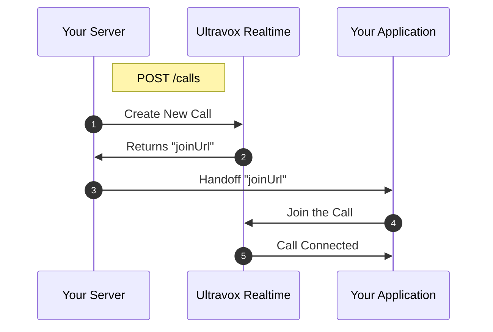

```mermaid
sequenceDiagram
  participant Server as Your Server
  participant UVRESTAPI as Ultravox Realtime
  participant App as Your Application

  autonumber
  Note left of UVRESTAPI: POST /calls
  Server ->> UVRESTAPI: Create New Call
  UVRESTAPI ->> Server: Returns "joinUrl"
  Server ->> App: Handoff "joinUrl"
  App ->> UVRESTAPI: Join the Call
  UVRESTAPI ->> App: Call Connected
```