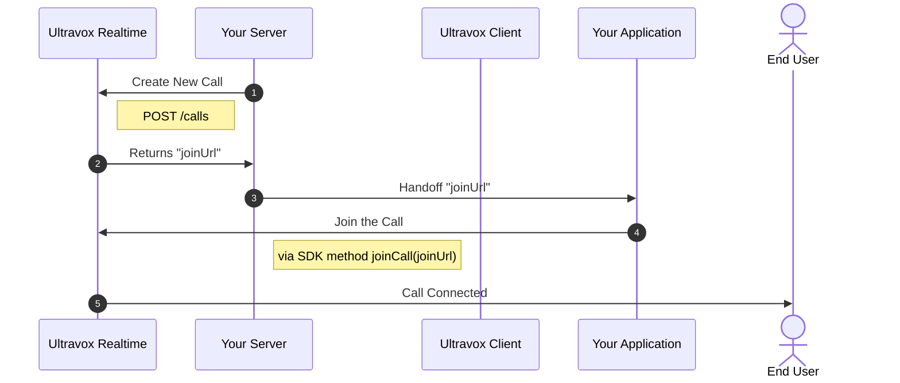

```mermaid
sequenceDiagram
  participant UVRESTAPI as Ultravox Realtime
  participant Server as Your Server
  participant UVClient as Ultravox Client
  participant App as Your Application
  actor user as End User

  autonumber
  Server ->> UVRESTAPI: Create New Call
  Note right of UVRESTAPI: POST /calls
  UVRESTAPI ->> Server: Returns "joinUrl"
  Server ->> App: Handoff "joinUrl"
  App ->> UVRESTAPI: Join the Call
  Note left of UVClient: via SDK method joinCall(joinUrl)
  UVRESTAPI->>user: Call Connected
```