Session Initiation Protocol (SIP) enables Ultravox agents to connect with your existing phone systems and SIP clients. This guide explains how to set up both incoming and outgoing SIP calls with Ultravox agents.

## Incoming SIP Calls
<Info>
  <b>Agents Required</b>
  <br />
  For incoming SIP, Ultravox will automatically create calls on your behalf in response to SIP INVITE requests. To facilitate this, you'll need to create an agent to receive calls before you set up incoming SIP.
</Info>

For incoming calls, you can configure Ultravox to accept calls from your SIP system then send a SIP invite directly to your agent. The SIP invite will create an Ultravox call and connect to it, no other requests required.

Ultravox supports two setups for incoming SIP calls: IP allowlisting and SIP registration. IP allowlisting works well with dedicated PBX systems, while SIP registration is recommended for cloud PBX setups.

In either setup, you can choose to allow incoming calls to all of your agents or to specific agents only. Calls will be created automatically from your agent's call template when a SIP invite is received.

By default, calls must be directed to the SIP user `agent_{agent_id}` to reach your agent, but you can override this with your own regex matching. The regex for your agents will be checked in order with the first matching agent used for the call. If none match, the global `agent_{agent_id}` will be used if allowAllAgents is enabled. Otherwise (or if that doesn't match either), the call will be rejected.

### IP Allowlisting
To set up IP Allowlisting, use the [sip configuration API](/api-reference/sip/sip-partial-update) to add your SIP system's public IP addresses to the `allowedCidrRanges` list. Entries in this list must be IPv4 [CIDR](https://en.wikipedia.org/wiki/Classless_Inter-Domain_Routing) ranges, e.g. `0.0.0.0/0` for any IP address (not recommended) or `91.200.160.14/32` for the single `91.200.160.14` IP address.

Once your SIP system's IP address(es) are allowed, you can have them send SIP invites to your agents using the pattern `agent_{agent_id}@{your_account_sip_domain}` by default. The value for `{your_account_sip_domain}` is available when you [view your SIP configuration](/api-reference/sip/sip-get). The user portion of the SIP address may be overridden by setting your own per-agent regex.

### SIP Registration
In the registration model, Ultravox acts as a SIP client (similar to a softphone) and registers with your SIP server as the user you specify. To set this up, you'll need to create a user in your PBX, configure your PBX to send relevant calls to that user, and then [create a registration](/api-reference/sip/sip-registrations-create) for that user in Ultravox.

When creating a registration, you'll need to provide the following information:
* `username`: The username of the user you created in your PBX.
* `password`: The password for that user.
* `proxy`: The domain or IP address of your SIP server.

In this case, you'll most likely want to alter the regex for your agents (see [above](#incoming-sip-calls)) since the to address on invites is unlikely to be `agent_{agent_id}`.
For example, if your PBX sends calls to `sip:sales@your_sip_domain`, you could set the regex for your sales agent to `^sales$`. Similarly, if your SIP server interacts with PSTN, you could have your agent answer calls to +1-555-123-4567 and +1-555-765-4321 by setting the regex to `^15551234567$|^15557654321$`.

### Personalizing the Call
Many parts of an agent can use context to personalize a call. (See [Call Template Configuration](/agents/building-and-editing-agents#call-template-configuration).) You can use SIP headers to populate template context for incoming SIP calls. Each header value is interpretted as JSON to allow for complex values.

For example including the headers `X-Customer-Name: Bob` and `X-Complex-Value: {"subkey": "value"}` becomes `{"customer_name": "Bob", "complex_value": {"subkey": "value"}}`.

In addition to headers you send, Ultravox will automatically add the following context values for incoming SIP calls, provided they are allowed by your agent's context schema:

* `ultravox.sip.caller_id`: The caller id presented for the incoming call, typically a phone number.
* `ultravox.sip.from_display_name`: The display name of the caller, often the name of a person or business if known and a phone number otherwise.
* `ultravox.sip.from_uri`: The full SIP URI of the caller.

If your agent's context allows additional properties (or allows these properties explicitly), the added context will be structured as:

```json
{
  "ultravox": {
    "sip": {
      "caller_id": "<caller_id>",
      "from_display_name": "<from_display_name>",
      "from_uri": "<from_uri>"
    }
  }
}
```

## Outgoing SIP Calls
For outgoing calls, you can create a SIP call with Ultravox Realtime [Create Agent Call](/api-reference/agents/agents-calls-post) or [Create Call](/api-reference/calls/calls-post) endpoints using the `sip` medium with `outgoing` property.

```js
medium: {
  sip: {
    outgoing: {
      to: "sip:<destination>@<sip_domain>",
      from: "<your_identifier>",
      username: "<authentication_username>",
      password: "<authentication_password>"
    }
  }
}
```

When you create the call, Ultravox will automatically send a SIP invite using the properties provided.

### Outgoing SIP Parameters
<ParamField body="to" type="string" required>
  The target SIP URL to which the Ultravox call will connect.

  Examples:
  `sip:username@domain`, `sip:+15551234567@carrier.com`
</ParamField>
<ParamField body="from" type="string" required>
  The caller identifier. Must conform to what your SIP trunk allows.
</ParamField>
<ParamField body="username" type="string">
  Optional. Username for connecting to your SIP trunk.
</ParamField>
<ParamField body="password" type="string">
  Optional. Password for connecting to your SIP trunk.
</ParamField>


### Examples

```js Example: Creating an Outgoing SIP Call to Linphone
    medium: {
      sip: {
        outgoing: {
          to: "sip:<username>@sip.linphone.org",
          from: "<company_name>"
        }
      }
    }
```

```js Example: Creating an Outgoing SIP Call using a Twilio trunk
    medium: {
      sip: {
        outgoing: {
          to: "+15551234567@trunkname.pstn.twilio.com",
          from: "+15557654321",  // Some phone number you've purchased from Twilio
          username: "authorized_user",  // A user you've created in Twilio allowed to use this number
          password: "password_for_authorized_user"
        }
      }
    }
```

## SIP Billing

Serving SIP calls requires additional infrastructure (provided by our SIP partner, Voximplant). Consequently, SIP
calls incur costs for SIP minutes in addition to the regular cost of call minutes. Like call minutes, SIP minutes are billed
per-deciminute (i.e. six second increments), rounded up to the nearest deciminute. Unlike call minutes, **SIP minutes are
billed when SIP infrastructure is active**, not just while your agent is connected to a user. In particular, **outgoing calls
are billed from the start of the call, not the point at which your user answers**. This means that an outgoing SIP call may
be billed for 0 minutes and non-zero SIP minutes if the call is not answered.

See https://ultravox.ai/pricing for current rates for SIP minutes.

The examples below illustrate how different call scenarios affect SIP billing. Red blocks correspond to segments of the call
that count toward the SIP duration while the blue block shows when your agent is connected (i.e. regular call minutes).

```mermaid
gantt
    title Typical outgoing call
    dateFormat x
    axisFormat %M:%S.%L

    section SIP Call
    Ringing                    :crit, 0, 20000ms
    Talking to Agent           :crit, 120000ms

    section Agent
    Connected         :active, 20000, 120000ms
```





```mermaid
gantt
    title Typical incoming call
    dateFormat x
    axisFormat %M:%S.%L

    section SIP Call
    Talking to Agent           :crit, 0, 120000ms

    section Agent
    Connected         :active, 0, 120000ms
```

### Transfers

Transfers often involve additional call legs that may increase the effective SIP duration of your call at double speed or
extend your call duration well beyond the duration during which your agent is active. Some examples follow:

* **Cold transfer with SIP REFER**: If the REFER is successful, all Ultravox infrastructure is removed from the call, so the SIP clock stops immediately. The SIP billing clock never runs at double rate for REFER cold transfers.

```mermaid
gantt
    title Referred cold transfer (outgoing)
    dateFormat x
    axisFormat %M:%S.%L

    section SIP Call
    Ringing                    :crit, 0, 20000ms
    Talking to Agent           :crit, 60000ms
    Refer ringing              :crit, 10000ms
    Talking to Transfer Target -> :crit, 0ms

    section Agent
    Connected                  :active, 20000, 70000ms
```



* **Bridged cold transfer**: A second call leg is created for the transfer target, so SIP minutes accumulate at double the normal rate while both calls are active. If the transfer is accepted, both legs remain active and continue billing even after the agent leaves the call.

```mermaid
gantt
    title Bridged cold transfer (outgoing)
    dateFormat x
    axisFormat %M:%S.%L

    section Initial Call
    Ringing                    :crit, 0, 20000ms
    Talking to Agent           :crit, 30000ms
    On Hold                    :crit, 10000ms
    Talking to Transfer Target :crit, 300000ms

    section Transfer Call
    Ringing                    :crit, 50000, 10000ms
    Talking to Initial User    :crit, 300000ms

    section Agent
    Connected                  :active, 20000, 40000ms
```



* **Warm transfer with REFER**: During the warm transfer process, a second call leg is created to connect the agent with the human operator and thus SIP minutes temporarily accumulate at double the normal rate. If the REFER is successful, all Ultravox infrastructure is removed from the call and thus the SIP clock stops immediately. If the REFER fails (and bridge fallback is not selected), the agent reconnects with the original user and continues the conversation as if the transfer were rejected. The SIP clock goes back to running at the normal rate as their is only one call leg remaining.

```mermaid
gantt
    title Referred warm transfer (outgoing)
    dateFormat x
    axisFormat %M:%S.%L

    section Initial Call
    Ringing                       :crit, 0, 20000ms
    Talking to Agent              :crit, 30000ms
    On Hold                       :crit, 50000ms
    Talking to Transfer Target -> :crit, 0ms

    section Transfer Call
    Ringing                    :crit, 50000, 10000ms
    Talking to Agent           :crit, 40000ms
    Talking to Initial User -> :crit, 0ms

    section Agent
    Connected                  :active, 20000, 80000ms
```

```mermaid
gantt
    title Rejected warm transfer (outgoing)
    dateFormat x
    axisFormat %M:%S.%L

    section Initial Call
    Ringing                    :crit, 0, 20000ms
    Talking to Agent           :crit, 30000ms
    On Hold                    :crit, 50000ms
    Talking to Agent           :crit, 30000ms

    section Transfer Call
    Ringing                    :crit, 50000, 10000ms
    Talking to Agent           :crit, 40000ms

    section Agent
    Connected                  :active, 20000, 110000ms
```





* **Bridged warm transfer**: A second call leg is created to connect the agent with the human operator, so SIP minutes accumulate at double the normal rate while both calls are active. If the transfer is accepted, both legs remain active and continue billing even after the agent leaves the call.

```mermaid
gantt
    title Bridged warm transfer (outgoing)
    dateFormat x
    axisFormat %M:%S.%L

    section Initial Call
    Ringing                    :crit, 0, 20000ms
    Talking to Agent           :crit, 30000ms
    On Hold                    :crit, 50000ms
    Talking to Transfer Target :crit, 300000ms

    section Transfer Call
    Ringing                    :crit, 50000, 10000ms
    Talking to Agent           :crit, 40000ms
    Talking to Initial User    :crit, 300000ms

    section Agent
    Connected                  :active, 20000, 80000ms
```



* **Warm transfer with TRY_REFER**: This will attempt to behave as in the REFER case, but will fallback to the bridged case (and thus cause additional SIP costs) if the REFER fails.

<Note>
  <b>Uncounted SIP time</b>
  <br />
  Due to some technical limitations, outgoing SIP calls with transfers may not be billed for the full ring time. This will only ever decrease the billed SIP duration.
</Note>


## Supported Transport Protocols
By default, UDP is used as the SIP transport protocol. You may optionally use TCP and/or TLS by explicitly adding a port and transport parameter to the target SIP URL.

| Protocol | How to Use in SIP URL                                |
|----------|------------------------------------------------------|
| UDP      | Default. No action required.                         |
| TCP      | `sip:<destination>@<sip_domain>:5060;transport=tcp`  |
| TLS      | `sip:<destination>@<sip_domain>:5060;transport=tls`  |


## Supported Codecs

Ultravox Realtime supports wideband (AKA "HD audio") and narrowband SIP via various codecs:

| Codec | Audio Quality |
|-------|---------------|
| G.722 | HD (16kHz) |
| G.722.1 | HD (16kHz) |
| G.722.2 | HD (16kHz) |
| Opus | Premium HD (48kHz) |
| G.711 (PCMU/u-law) | Standard (8kHz) |
| G.711 (PCMA/a-law) | Standard (8kHz) |
| iLBC | Standard (8kHz) |

Using any other codec will cause calls to fail.

## Logs
Once a call has ended, you can see SIP logs for the call using the [sip logs](/api-reference/calls/calls-sip-logs-get) endpoint.
